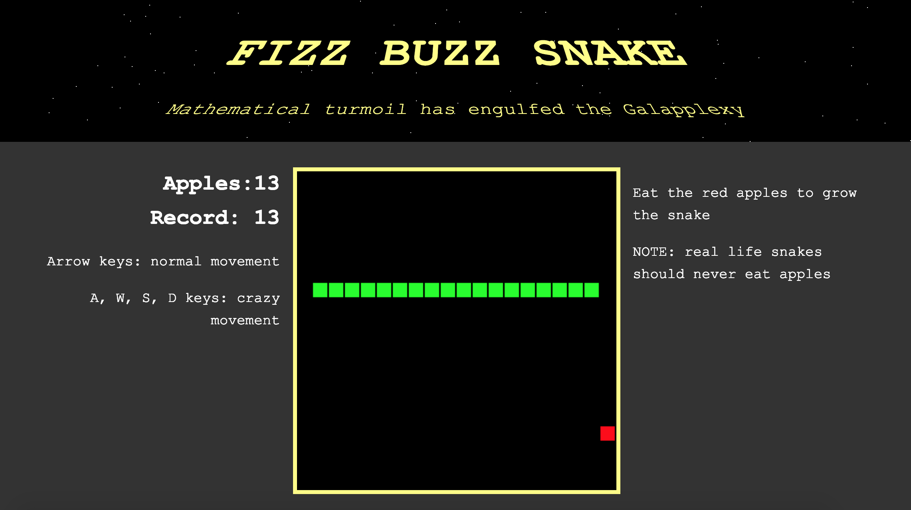
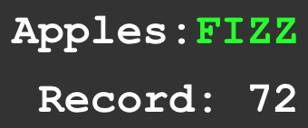

## Snake vs the Fizz Buzz Interview question
[Here](https://fizz-buzz-snake.herokuapp.com/) :arrow_left: is a deployed version of the game, ready to play.

(it is desktop only, if anyone knows a quick way to map mobile screen taps to desktop arrow keys please let me know).

If you want to jump straight into the game code and tinker, here's a [pen](https://codepen.io/TimDay88/pen/JzLKRQ?editors=1010)

  

You cannot beat this :wink:

  

Build with react/redux, sass, express, node and heroku. The fizz buzz logic can be found in the component SideBarLeft.js
